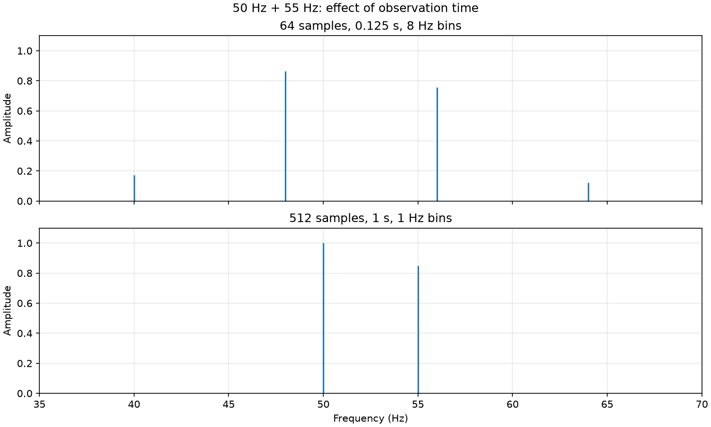

# FFT worksheet solution

Completed from [LESSONS.md](LESSONS.md). The original cases remain available, and Part 7's **option B** is included as a fourth, longer-record case.

## Part 1: Before running anything

1. An FFT decomposes a uniformly sampled signal into discrete frequency components. Its complex coefficients encode amplitude and phase; this project displays the one-sided amplitude spectrum, showing how strongly each frequency contributes.
2. **Sampling rate** is the number of samples per second, $f_s=1/\Delta t$. **Nyquist frequency** is $f_N=f_s/2$, the upper boundary of the unaliased frequency range; faithful recovery of arbitrary sinusoidal phase requires frequencies strictly below it and no higher-frequency contamination. **Frequency resolution**, in the worksheet's sense, is the FFT bin spacing $\Delta f=f_s/N=1/T$. Actual ability to distinguish peaks also depends on the observation window and signal properties.
3. The routine assigns sample index $n$ to time $n\Delta t$ and FFT bin $j$ to frequency $j/(N\Delta t)$. Unequal time intervals invalidate that interpretation. The oscillator solver can use adaptive internal steps because its output is requested at uniformly spaced times before the FFT.

## Part 2: Build and run

Ran `make run`, then `make -B run` to force compilation of all sources. The rebuild completed without compiler warnings. The original run is recorded separately; `make run` now also includes the Part 7 comparison case.

1. The programs generate these ten CSV files:

   - `output/good_sampling_signal.csv`
   - `output/good_sampling_spectrum.csv`
   - `output/undersampled_signal.csv`
   - `output/undersampled_spectrum.csv`
   - `output/short_record_signal.csv`
   - `output/short_record_spectrum.csv`
   - `output/long_record_signal.csv`
   - `output/long_record_spectrum.csv`
   - `output/coupled_oscillators_time.csv`
   - `output/coupled_oscillators_spectrum.csv`

2. `src/sampling_demo.c` (executable `build/sampling_demo`) studies sampling, aliasing, and record length using prescribed sinusoidal signals.
3. `src/coupled_oscillators_fft.c` (executable `build/coupled_oscillators_fft`) integrates a mechanical system and analyzes its displacement.
4. The well-sampled case reports **50.000 Hz** and **120.000 Hz**, with amplitudes **1.0000** and **0.7000**, respectively.

The sampling results are:

| Case | $f_s$ (Hz) | $N$ | $T=N/f_s$ (s) | $f_N$ (Hz) | $\Delta f$ (Hz) | Reported local peaks (Hz) |
|---|---:|---:|---:|---:|---:|---|
| good_sampling | 512 | 512 | 1 | 256 | 1 | 50, 120 |
| undersampled | 128 | 128 | 1 | 64 | 1 | 50, 8 |
| short_record | 512 | 64 | 0.125 | 256 | 8 | 48 |
| long_record (option B) | 512 | 512 | 1 | 256 | 1 | 50, 55 |

## Part 3: Sampling and aliasing

For the specified $f_s=128\,\mathrm{Hz}$,

$$f_N=\frac{128}{2}=64\,\mathrm{Hz}.$$

The 120 Hz component exceeds 64 Hz, so it cannot be uniquely reconstructed from these samples. The observations do not track the motion between sample times, allowing different continuous oscillations to produce identical samples. Mathematically, at $t_n=n/128$,

$$\sin\left(2\pi\frac{120n}{128}\right)
=\sin\left(2\pi n-2\pi\frac{8n}{128}\right)
=-\sin\left(2\pi\frac{8n}{128}\right).$$

Thus the sampled 120 Hz sine is indistinguishable from an 8 Hz sine with reversed sign (a phase shift of $\pi$). Its one-sided amplitude spectrum has a positive-frequency peak at

$$f_{\mathrm{alias}}=|120-128|=8\,\mathrm{Hz}.$$

The generated spectrum confirms a peak at **8.000 Hz**, amplitude **0.7000**, alongside the unaffected **50.000 Hz** peak, amplitude **1.0000**. The discrete data alone cannot establish which continuous frequency produced the alias without additional prior information.

## Part 4: Frequency resolution

The original short-record case contains 50 Hz and 55 Hz and uses $N=64$ and $f_s=512\,\mathrm{Hz}$:

$$\Delta t=\frac{1}{512}\,\mathrm{s},\qquad
T=N\Delta t=\frac{64}{512}=0.125\,\mathrm{s},$$

$$\Delta f=\frac{512}{64}=8\,\mathrm{Hz}.$$

Here $T=N\Delta t$ is the FFT record duration; the last recorded sample is at $(N-1)\Delta t=0.123046875\,\mathrm{s}$ because sampling starts at zero.

The frequency separation is only $55-50=5\,\mathrm{Hz}$, smaller than the 8 Hz bin spacing. Neither tone is on a bin: nearby bins are 48 and 56 Hz. The finite record spreads spectral amplitude over neighboring bins, and the spectrum does not show two cleanly separated local maxima. The program reports only **48.000 Hz**, amplitude **0.8651**; this is not a true change in the input frequencies.

I would first increase the **total acquisition time**, collecting more samples at the same sampling rate. This decreases $\Delta f$ and allows the close components to separate. Changing a plotting tool or file format cannot add information to the record. Zero-padding alone would only interpolate the spectrum, rather than collect the longer observation needed here.

## Part 5: Coupled oscillators

1. The equations implemented in `rhs` are

   $$m\ddot{x}_1=-(k+k_c)x_1+k_cx_2,$$
   $$m\ddot{x}_2=k_cx_1-(k+k_c)x_2.$$

   The parameters are $m=1\,\mathrm{kg}$, $k=25\,\mathrm{N/m}$, and $k_c=7\,\mathrm{N/m}$.

2. These describe two identical masses, each attached to a fixed wall by a spring of stiffness $k$, and connected to each other by a spring of stiffness $k_c$. Displacements are measured from equilibrium. There is no damping or external forcing.

3. The **in-phase mode** has $x_1=x_2$, so the coupling spring does not change length:

   $$f_{\mathrm{in}}=\frac{1}{2\pi}\sqrt{\frac{k}{m}}=0.7957747\,\mathrm{Hz}.$$

   The **out-of-phase mode** has $x_1=-x_2$, so the coupling spring supplies an additional restoring force:

   $$f_{\mathrm{out}}=\frac{1}{2\pi}\sqrt{\frac{k+2k_c}{m}}=0.9939223\,\mathrm{Hz}.$$

4. The initial conditions are $x_1(0)=0.10\,\mathrm{m}$, $x_2(0)=0$, and both velocities zero. The displacement vector decomposes as $0.05(1,1)+0.05(1,-1)$, exciting both modes. Analytically,

   $$x_1(t)=0.05\cos(\sqrt{25}\,t)+0.05\cos(\sqrt{39}\,t),$$

   so its FFT contains both mode frequencies.

5. Comparing numerical peaks with theory checks the physical model, ODE integration, time sampling, and conversion of FFT bins to frequencies. Agreement within the spectral resolution supports the calculation; a large mismatch would point to a possible error in this pipeline.

## Part 6: Plot inspection

Ran `make plot-python` successfully. It generates `plots/sampling_signals.png`, `plots/sampling_spectra.png`, `plots/record_length_comparison.png`, `plots/coupled_oscillators_time.png`, and `plots/coupled_oscillators_spectrum.png`.

1. The middle panel of [sampling_spectra.png](plots/sampling_spectra.png) makes aliasing easiest to see, especially compared with the top panel: the 120 Hz peak is replaced by an 8 Hz peak while 50 Hz remains.
2. The third panel of the same figure shows limited resolution in the 64-sample record. The 48 and 56 Hz bins carry substantial amplitude, with no resolved valley between two peaks at the actual frequencies 50 and 55 Hz. The fourth panel shows the longer record. The focused [record-length comparison](plots/record_length_comparison.png) makes the difference easiest to see.
3. In [coupled_oscillators_spectrum.png](plots/coupled_oscillators_spectrum.png), both numerical peaks line up closely with the theoretical dashed reference lines:

| Mode | Theory (Hz) | FFT peak (Hz) | FFT minus theory (Hz) | Measured amplitude (m) |
|---|---:|---:|---:|---:|
| In phase | 0.7957747 | 0.7968750 | +0.0011003 | 0.0486 |
| Out of phase | 0.9939223 | 0.9921875 | -0.0017348 | 0.0462 |

4. The oscillator record has $N=1024$, $\Delta t=0.125\,\mathrm{s}$, $T=128\,\mathrm{s}$, and $\Delta f=1/128=0.0078125\,\mathrm{Hz}$. Both discrepancies are smaller than half a bin, $0.00390625\,\mathrm{Hz}$. The theoretical frequencies lie between bins, and the program reports bin centers without interpolation. Finite observation time and the rectangular window cause spectral leakage, also explaining why peak-bin amplitudes are below the theoretical 0.05 m per mode. ODE truncation error, solver tolerances, and floating-point roundoff can contribute, but bin spacing already accounts for the observed frequency offsets.

## Part 7: Option B — change the observation time

### Modification and prediction before rerunning

I kept `short_record` at 64 samples and added `long_record` with 512 samples in `src/sampling_demo.c`. Both use `sample_rate_hz = 512.0` and the same 50 Hz + 55 Hz signal. The sample counts remain powers of two as required by the radix-2 FFT. Running the program now prints both results in sequence and writes separate CSV files.

The prediction was:

$$T_{\mathrm{new}}=\frac{512}{512}=1\,\mathrm{s},\qquad
\Delta f_{\mathrm{new}}=1\,\mathrm{Hz}.$$

This is eight times the original duration and one eighth of the original bin spacing. The Nyquist frequency stays at 256 Hz. The two frequencies should become distinguishable, five bins apart. Both complete an integer number of cycles in the new record, so I expected peaks exactly at 50 and 55 Hz with amplitudes 1.00 and 0.85, up to floating-point error.

### Execution and comparison

To reproduce both cases and the plots, run:

```bash
make plot-python
```

The `long_record` section of the program output reports:

```text
sampling rate = 512.0 Hz, Nyquist = 256.0 Hz, duration = 1.000 s
FFT frequency resolution = 1.000 Hz
peak 1: f = 50.000 Hz, amplitude = 1.0000
peak 2: f = 55.000 Hz, amplitude = 0.8500
```

| Quantity | Original record | Longer record |
|---|---:|---:|
| Samples | 64 | 512 |
| Duration (s) | 0.125 | 1.000 |
| Bin spacing (Hz) | 8 | 1 |
| Reported peak frequencies (Hz) | 48 | 50 and 55 |
| Reported amplitudes | 0.8651 | 1.0000 and 0.8500 |

The result agrees with the prediction: the two true components become cleanly distinguishable. This demonstrates improvement through a longer acquisition, with no change in the sampling rate.



The generated `output/short_record_spectrum.csv` and
`output/long_record_spectrum.csv` contain the two FFTs. `make run` recreates
these files directly from the current source; no patch is needed.
